# Introduction

## [About Mermaid](https://mermaid-js.github.io/mermaid/#/README?id=about-mermaid)

**Mermaid lets you create diagrams using text and code.** This simplifies the maintenance of complex diagrams. It is a Javascript based diagramming and charting tool that renders Markdown-inspired text definitions to create and modify diagrams dynamically.

> If you are familiar with Markdown you should have no problem learning [Mermaid's Syntax](https://mermaid-js.github.io/mermaid/#/./n00b-syntaxReference).


**Edit this Page** [](https://github.com/mermaid-js/mermaid/blob/develop/docs/README.md)

[](https://travis-ci.org/mermaid-js/mermaid) [](https://www.npmjs.com/package/mermaid) [](https://coveralls.io/github/mermaid-js/mermaid?branch=master) [](https://join.slack.com/t/mermaid-talk/shared_invite/enQtNzc4NDIyNzk4OTAyLWVhYjQxOTI2OTg4YmE1ZmJkY2Y4MTU3ODliYmIwOTY3NDJlYjA0YjIyZTdkMDMyZTUwOGI0NjEzYmEwODcwOTE) [](https://percy.io/Mermaid/mermaid)

The main purpose of Mermaid is to help Documentation catch up with Development.

> Documentation-Rot is a Catch-22 that Mermaid helps to solve.

Diagramming and Documentation costs precious developer time and gets outdated quickly. But not having diagrams or docs ruins productivity and hurts organizational learning.

Mermaid addresses this Catch-22 by cutting the time, effort and tooling that is required to create modifiable diagrams and charts, for smarter and more reusable content. Mermaid, as a text-based diagramming tool allows for quick and easy updates, it can also be made part of production scripts (and other pieces of code), to make documentation much easier.

> Mermaid is a Diagramming tool for everyone.

Even non-programmers can create diagrams through the [Mermaid Live Editor](https://github.com/mermaid-js/mermaid-live-editor), Visit the [Tutorials Page](https://mermaid-js.github.io/mermaid/#/./Tutorials) for the Live Editor video tutorials.

Many editors, wikis and other tools also have mermaid integrations and plugins, making it easy to start using mermaid. A few of those are described in [Simple start to write diagrams](https://mermaid-js.github.io/mermaid/#/./n00b-gettingStarted).

Want to see what can be built with mermaid, or what applications already support it? Read the [Integrations and Usages for Mermaid](https://mermaid-js.github.io/mermaid/#/./integrations).

For a more detailed introduction to Mermaid and some of it's more basic uses, look to the [Overview for Beginners](https://mermaid-js.github.io/mermaid/#/./n00b-overview) and [Usage](https://mermaid-js.github.io/mermaid/#/./usage).

🌐 [CDN](https://unpkg.com/mermaid/) | 📖 [Documentation](https://mermaidjs.github.io/) | 🙌 [Contribution](https://github.com/mermaid-js/mermaid/blob/develop/docs/development.md) | 📜 [Version Log](https://mermaid-js.github.io/mermaid/#/./CHANGELOG)

> 🖖 Keep a steady pulse: mermaid needs more Collaborators, [Read More](https://github.com/knsv/mermaid/issues/866).

 **Mermaid was nominated and won the [JS Open Source Awards (2019)](https://osawards.com/javascript/#nominees) in the category "The most exciting use of technology"!!!**

**Thanks to all involved, people committing pull requests, people answering questions and special thanks to Tyler Long who is helping me maintain the project 🙏**

### [Diagrams that mermaid can render](https://mermaid-js.github.io/mermaid/#/README?id=diagrams-that-mermaid-can-render)

#### [Flowchart](https://mermaid-js.github.io/mermaid/#/flowchart?id=flowcharts-basic-syntax)


#### [Sequence diagram](https://mermaid-js.github.io/mermaid/#/sequenceDiagram)

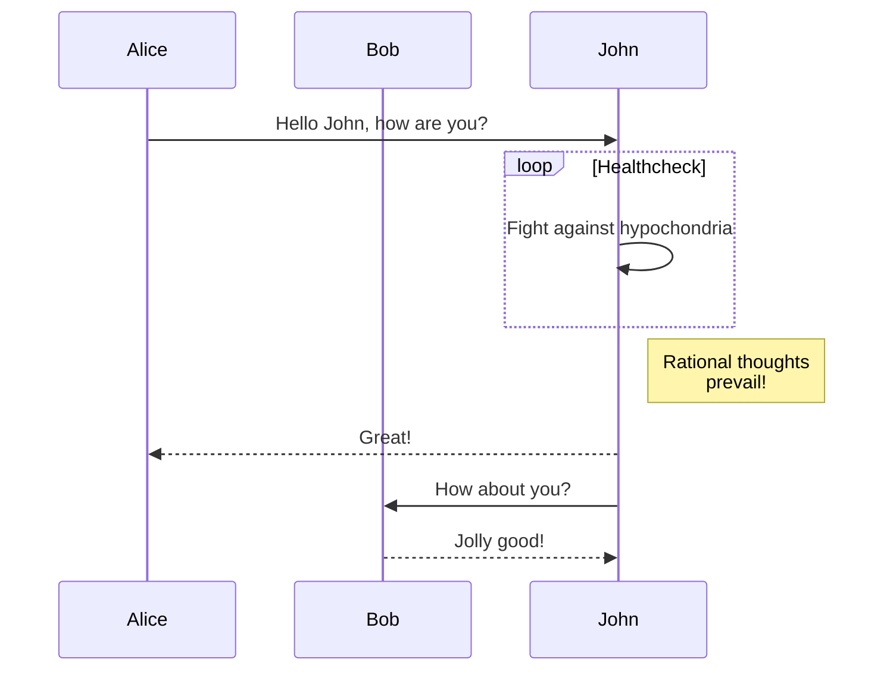

#### [Gantt diagram](https://mermaid-js.github.io/mermaid/#/gantt)

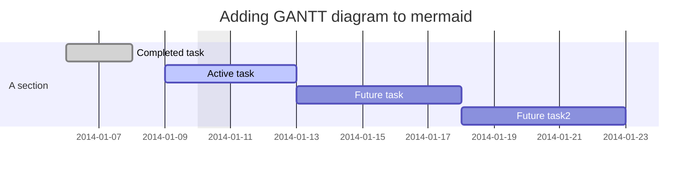


#### [Class diagram](https://mermaid-js.github.io/mermaid/#/classDiagram)

```
classDiagram
Class01 <|-- AveryLongClass : Cool
Class03 *-- Class04
Class05 o-- Class06
Class07 .. Class08
Class09 --> C2 : Where am i?
Class09 --* C3
Class09 --|> Class07
Class07 : equals()
Class07 : Object[] elementData
Class01 : size()
Class01 : int chimp
Class01 : int gorilla
Class08 <--> C2: Cool label
```

#### [Git graph - experimental](https://mermaid-js.github.io/mermaid/#/README?id=git-graph-exclamation-experimental)


#### [Entity Relationship Diagram - experimental](https://mermaid-js.github.io/mermaid/#/entityRelationshipDiagram)

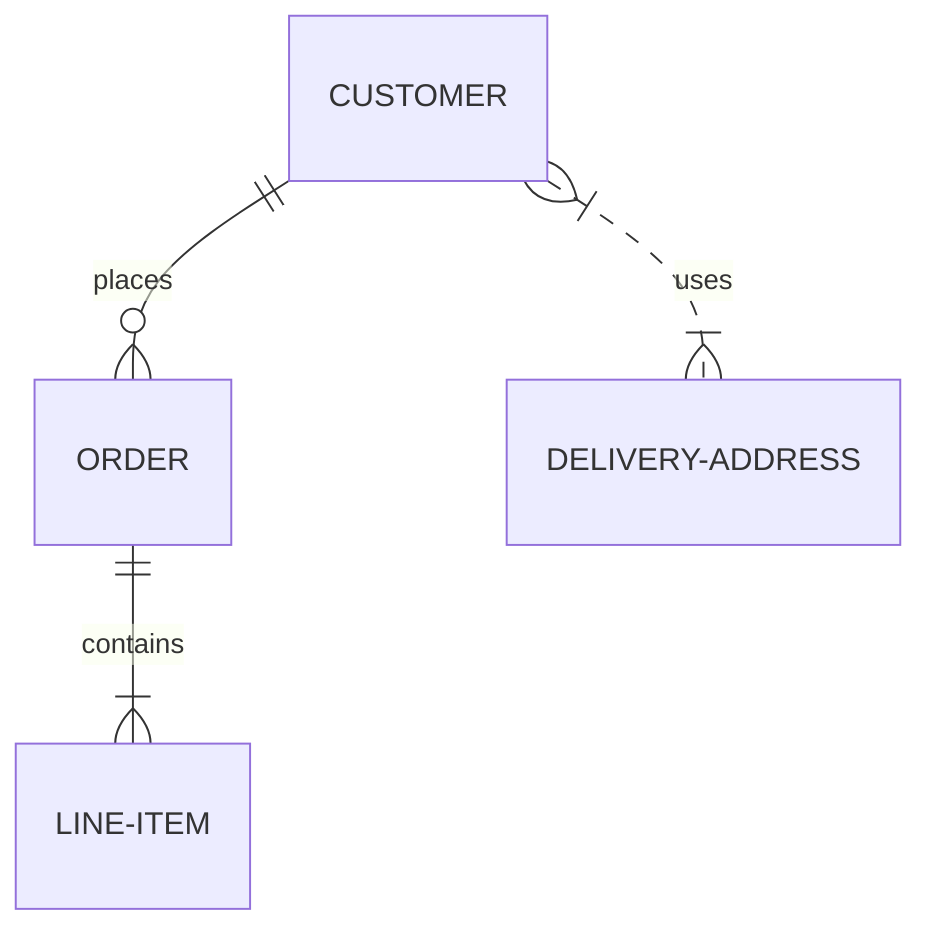

#### [User Journey Diagram](https://mermaid-js.github.io/mermaid/#/user-journey)

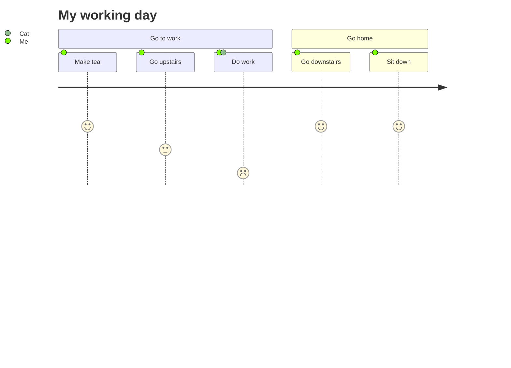

### [Installation](https://mermaid-js.github.io/mermaid/#/README?id=installation)

**In depth guides and examples can be found in [Getting Started](https://mermaid-js.github.io/mermaid/#/n00b-gettingStarted) and [Usage](https://mermaid-js.github.io/mermaid/#/usage).**

**It would also be helpful to learn more about mermaid's [Syntax](https://mermaid-js.github.io/mermaid/#/n00b-syntaxReference).**

#### [CDN](https://mermaid-js.github.io/mermaid/#/README?id=cdn)

```
https://unpkg.com/mermaid@<version>/dist/
```

To select a version:

Replace `<version>` with the desired version number.

Latest Version: https://unpkg.com/browse/mermaid@8.8.0/

### [Deploying Mermaid](https://mermaid-js.github.io/mermaid/#/README?id=deploying-mermaid)

To Deploy Mermaid:

```
1.You will need to install node v10 or 12, which would have npm

2. download yarn using npm.

3. enter the following command:
    yarn add mermaid

4. You can then add mermaid as a dev dependency using this command:
    yarn add --dev mermaid
```

### [Mermaid API](https://mermaid-js.github.io/mermaid/#/./Setup):

**To deploy mermaid without a bundler, one can insert a `script` tag with an absolute address and a `mermaidAPI` call into the HTML like so:**

```html
<script src="https://cdn.jsdelivr.net/npm/mermaid/dist/mermaid.min.js"></script>
<script>mermaid.initialize({startOnLoad:true});</script>
```

**Doing so will command the mermaid parser to look for the `<div>` tags with `class="mermaid"`. From these tags mermaid will try to read the diagram/chart definitons and render them into svg charts.**

**Examples can be found in** [Other examples](https://mermaid-js.github.io/mermaid/#/examples)

### [Sibling projects](https://mermaid-js.github.io/mermaid/#/README?id=sibling-projects)

- [Mermaid Live Editor](https://github.com/mermaid-js/mermaid-live-editor)
- [Mermaid CLI](https://github.com/mermaid-js/mermaid-cli)
- [Mermaid Webpack Demo](https://github.com/mermaidjs/mermaid-webpack-demo)
- [Mermaid Parcel Demo](https://github.com/mermaidjs/mermaid-parcel-demo)

### [Request for Assistance](https://mermaid-js.github.io/mermaid/#/README?id=request-for-assistance)

Things are piling up and I have a hard time keeping up. To remedy this it would be great if we could form a core team of developers to cooperate with the future development of mermaid.

As part of this team you would get write access to the repository and would represent the project when answering questions and issues.

Together we could continue the work with things like:

- Adding more types of diagrams like mindmaps, ert diagrams, etc.
- Improving existing diagrams

Don't hesitate to contact me if you want to get involved!

### [For contributors](https://mermaid-js.github.io/mermaid/#/README?id=for-contributors)

#### [Setup](https://mermaid-js.github.io/mermaid/#/README?id=setup)

```
yarn install
```

#### [Build](https://mermaid-js.github.io/mermaid/#/README?id=build)

```
yarn build:watch
```

#### [Lint](https://mermaid-js.github.io/mermaid/#/README?id=lint)

```
yarn lint
```

We use [eslint](https://eslint.org/). We recommend you installing [editor plugins](https://eslint.org/docs/user-guide/integrations) so you can get real time lint result.

#### [Test](https://mermaid-js.github.io/mermaid/#/README?id=test)

```
yarn test
```

Manual test in browser: open `dist/index.html`

#### [Release](https://mermaid-js.github.io/mermaid/#/README?id=release)

For those who have the permission to do so:

Update version number in `package.json`.

```
npm publish
```

Command above generates files into the `dist` folder and publishes them to npmjs.org.

### [Credits](https://mermaid-js.github.io/mermaid/#/README?id=credits)

Many thanks to the [d3](http://d3js.org/) and [dagre-d3](https://github.com/cpettitt/dagre-d3) projects for providing the graphical layout and drawing libraries!

Thanks also to the [js-sequence-diagram](http://bramp.github.io/js-sequence-diagrams) project for usage of the grammar for the sequence diagrams. Thanks to Jessica Peter for inspiration and starting point for gantt rendering.

*Mermaid was created by Knut Sveidqvist for easier documentation.*

Here is the full list of the projects [contributors](https://github.com/knsv/mermaid/graphs/contributors).

## [A basic mermaid User-Guide for Beginners](https://mermaid-js.github.io/mermaid/#/n00b-gettingStarted?id=a-basic-mermaid-user-guide-for-beginners)

Creating diagrams and charts using mermaid code is simple. The code is turned into a diagram in the web page with the use of a mermaid renderer.

The mermaid renderer is a piece of javascript that parses mermaid definitions, when called. This then renders a diagram based on that code in SVG.

Most web browsers, such as Firefox, Chrome and Safari, can render mermaid, Internet Explorer however cannot.

### [For beginners, there are four relatively easy ways you can use mermaid:](https://mermaid-js.github.io/mermaid/#/n00b-gettingStarted?id=for-beginners-there-are-four-relatively-easy-ways-you-can-use-mermaid)

1. Using the mermaid [live editor](https://mermaid-js.github.io/mermaid-live-editor/). For some popular video tutorials on the live editor go to [Overview](https://mermaid-js.github.io/mermaid/#/./n00b-overview).
2. Using one of the many [mermaid plugins](https://mermaid-js.github.io/mermaid/#/../overview/integrations).
3. Hosting mermaid on a webpage, with an absolute link.
4. Downloading mermaid and hosting it on your Web Page.

**Notes**: More in depth information can be found on [Usage](https://mermaid-js.github.io/mermaid/#/./usage).

### [Following any of these examples, you can get started with creating your own diagrams using mermaid code.](https://mermaid-js.github.io/mermaid/#/n00b-gettingStarted?id=following-any-of-these-examples-you-can-get-started-with-creating-your-own-diagrams-using-mermaid-code)

#### [1. The mermaid live editor:](https://mermaid-js.github.io/mermaid/#/n00b-gettingStarted?id=_1-the-mermaid-live-editor)

A great way to get started with mermaid is to visit [The mermaid live editor](https://mermaidjs.github.io/mermaid-live-editor).

In the `Code` section one can write or edit raw mermaid code, and instantly `Preview` the rendered result on the panel beside it.

**This is a great way to learn how to define a mermaid diagram.**

For some popular video tutorials on the live editor go to [Overview](https://mermaid-js.github.io/mermaid/#/./n00b-overview).


**Notes:**

You can also click "Copy Markdown" to copy the markdown code for the diagram, that can then be pasted directly into your documentation.


The `Mermaid configuration` is for configuring the appearance and behavior of mermaid diagrams. An easy introduction to mermaid configuration is found in the [Advanced usage](https://mermaid-js.github.io/mermaid/#/./n00b-advanced) section. A complete configuration reference cataloguing default values is found on the [mermaidAPI](https://mermaid-js.github.io/mermaid/#/Setup) page.


#### [2. Using mermaid plugins:](https://mermaid-js.github.io/mermaid/#/n00b-gettingStarted?id=_2-using-mermaid-plugins)

Thanks to the growing popularity of mermaid, many plugins already allow the generation of mermaid diagrams from within popular applications. An extensive list of applications the support mermaid plugins can be found [here](https://mermaid-js.github.io/mermaid/#/./integrations).

**This is covered in greater detail in the [Usage section](https://mermaid-js.github.io/mermaid/#/usage)**

#### [3. Deploying mermaid on the Browser](https://mermaid-js.github.io/mermaid/#/n00b-gettingStarted?id=_3-deploying-mermaid-on-the-browser)

This method can be used with any common web server. Apache, IIS, nginx, node express [...], you pick your favourite.

We do not need to install anything on the server, apart from a program (like Notepad++) that can generate an html file, which is then deployed by a web browser (such as Firefox, Chrome, Safari, but not Internet Explorer).

So if you want to really simplify things when testing this out, don't use a web server at all but just create an HTML file locally and drag it into your browser window. The browser will do the work of rendering the mermaid diagrams according to the descriptions you've given!

#### [Note that all this is written in the html `` section of the web page.](https://mermaid-js.github.io/mermaid/#/n00b-gettingStarted?id=note-that-all-this-is-written-in-the-html-ltbodygt-section-of-the-web-page)

When writing the html file, we give the web browser three instructions inside the html code:	

a. A reference for fetching the online mermaid renderer, which is written in Javascript.

b. The mermaid code for the diagram we want to create.

c. The `mermaid.initialize()` call to start the rendering process.

#### [This is what needs to go into the html file (and all of them are important), for the mermaidAPI to render the diagrams:](https://mermaid-js.github.io/mermaid/#/n00b-gettingStarted?id=this-is-what-needs-to-go-into-the-html-file-and-all-of-them-are-important-for-the-mermaidapi-to-render-the-diagrams)

#### [a. A reference to the address of the `mermaid.js` or the `mermaid.min.js` file has to be contained in a `` tag like so:](https://mermaid-js.github.io/mermaid/#/n00b-gettingStarted?id=a-a-reference-to-the-address-of-the-mermaidjs-or-the-mermaidminjs-file-has-to-be-contained-in-a-ltscript-srcgt-tag-like-so)

```html
<body>
  <script src="https://cdn.jsdelivr.net/npm/mermaid/dist/mermaid.min.js"></script>
</body>
```

#### [b. The embedded mermaid diagram definition needs to be contained inside a `` tag that signifies that it is a mermaid diagram:](https://mermaid-js.github.io/mermaid/#/n00b-gettingStarted?id=b-the-embedded-mermaid-diagram-definition-needs-to-be-contained-inside-a-ltdivgt-tag-that-signifies-that-it-is-a-mermaid-diagram)

```html
<body>
  Here is a mermaid diagram:
  <div class="mermaid">
    graph TD
    A[Client] --> B[Load Balancer]
    B --> C[Server01]
    B --> D[Server02]
  </div>
</body>
```

**Notes**: every mermaid chart/graph/diagram definition, has to have separate `<div>` tags.

#### [c. The `mermaid.initialize()` API call](https://mermaid-js.github.io/mermaid/#/n00b-gettingStarted?id=c-the-mermaidinitialize-api-call)

`mermaid.initialize()` calls take all the definitions contained in `<div class="mermaid">` tags it can find in the html body and starts to render them one by one. It is called this way:

```html
<body>
  <script>mermaid.initialize({startOnLoad:true});</script>
</body>
```

**Notes**: It is good practice to keep the `mermaid.initialize()` API call right next the `mermaid.min.js` `script` tag. `startOnLoad` is a parameter that can optionally be changed to false, this would then prevent mermaid from immediately rendering upon loading.

#### [If the three steps mentioned are followed you will end up with something like this:](https://mermaid-js.github.io/mermaid/#/n00b-gettingStarted?id=if-the-three-steps-mentioned-are-followed-you-will-end-up-with-something-like-this)

```html
<html>
  <body>
    <script src="https://cdn.jsdelivr.net/npm/mermaid/dist/mermaid.min.js"></script>
    <script>mermaid.initialize({startOnLoad:true});</script>

    Here is one mermaid diagram:
    <div class="mermaid">
      graph TD
      A[Client] --> B[Load Balancer]
      B --> C[Server1]
      B --> D[Server2]
    </div>

    And here is another:
    <div class="mermaid">
      graph TD
      A[Client] -->|tcp_123| B(Load Balancer)
      B -->|tcp_456| C[Server1]
      B -->|tcp_456| D[Server2]
    </div>
  </body>
</html>
```

**Notes**: This has to be saved in an `HTML` file and opened with a browser.

------

#### [4. Calling mermaid from a relative link.](https://mermaid-js.github.io/mermaid/#/n00b-gettingStarted?id=_4-calling-mermaid-from-a-relative-link)

This method is similar to 3, if only a little more involved. The difference may be very subtle even, but it offers its own advantages, mainly in speed.

1. install node v10 or 12, which would have npm

2. download yarn using npm by entering the command below: npm install -g yarn

3. After yarn installs, enter the following command: yarn add mermaid

4. After downloading mermaid, you can then open the mermaid file you’ve downloaded and go to the `dist` folder.

5. Find the `mermaid.min.js` file, a. select the file. b. press the shift key and right click on it c. select copy as path from the options.

6. Paste it within the `script` tag as the `src`.

   ```html
   <script src="Paste the mermaid.min.js file address here"></script>
   <script>mermaid.initialize({startOnLoad:true});</script>
   ```

7. It should look something like this

   ```html
   <script src="C:\Users\myPC\mermaid\dist\mermaid.js"></script>
   <script>mermaid.initialize({startOnLoad:true});</script>
   ```

8. Add the graph and diagram definitions as you would in number 3. a. be mindful of the `div` tags.

9. Save, load/edit your HTML file to your liking.

**Note** placing the HTML file on the same folder the `mermaid` file you've downloaded is a good practice and allows you to shorten the address on the `src` section.

**As seen here, in this full example:**

```html
<html lang="en">
<head>
  <meta charset="utf-8">
</head>
<body>
  <div class="mermaid">
  graph LR
      A --- B
      B-->C[fa:fa-ban forbidden]
      B-->D(fa:fa-spinner);
  </div>
  <div class="mermaid">
     graph TD
     A[Client] --> B[Load Balancer]
     B --> C[Server1]
     B --> D[Server2]
  </div>
  <script src="C:\Users\MyPC\mermaid\dist\mermaid.js"></script>
  <script>mermaid.initialize({startOnLoad:true});</script>
</body>
</html>
```

**Three additional comments from Knut Sveidqvist, creator of mermaid:**

- In early versions of mermaid, the `<script src>` tag was invoked in the `<head>` part of the web page. Nowadays we can place it directly in `<body>` as seen above. However, older parts of the documentation frequently reflects the previous way which still works.
- We initialize the mermaid rendering with `mermaid.initialize()` directly in the html code. In principle this could be done through placing `mermaid.initialize()` inside of `mermaid.min.js`. We would then eliminate the need for this explicit line in the html. However, there are use cases where we do want to separate the two steps. Sometimes we want full control over when we start looking for `<div>`tags inside the web page with `mermaid.initialize()`, for example when we think that all `<div>` tags may not have been loaded by the time `mermaid.min.js` runs.
- In the third method, `mermaid.min.js` is called using an absolute path. Even worse, the example includes the mermaid version number which of course will change as time goes by. However, the example makes it easy to understand what is going on - even though it is perhaps doomed in a way we do not want in a production environment. When going from testing mermaid out to getting serious with it, I would suggest one of the following approaches for calling `mermaid.min.js`:
  1. If you do not enter a specific version, you automatically get the latest one.
  2. If you really need a specific version, hard code it (this is rare but it happens).
  3. If you need to know the current mermaid version, replace a mermaid code block with the word `info` and the version will be returned like [this](https://mermaid-js.github.io/mermaid-live-editor/#/edit/eyJjb2RlIjoiaW5mb1xuXG4iLCJtZXJtYWlkIjp7InRoZW1lIjoiZGVmYXVsdCJ9fQ==)

## [Overview for Beginners](https://mermaid-js.github.io/mermaid/#/n00b-overview?id=overview-for-beginners)

### [Explaining with a Diagram](https://mermaid-js.github.io/mermaid/#/n00b-overview?id=explaining-with-a-diagram)

A picture is worth a thousand words, a good diagram would be worth more. There is no disputing that they are indeed very useful. Yet very few people use them, even fewer still do so for documentation. Mainly because it takes too much time that could be used for more important functions.

### [Creating and Maintaining Diagrams](https://mermaid-js.github.io/mermaid/#/n00b-overview?id=creating-and-maintaining-diagrams)

Anyone who has used Visio, or (God Forbid) Excel to make a Gantt Chart, knows how hard it is to make, edit and maintain good visualizations.

In an environment of constantly changing information , diagrams/charts are both very important and also become obsolete/inaccurate very fast. This catch-22 hobbles the information transfer and productivity in teams.

## [Doc Rot in Diagrams](https://mermaid-js.github.io/mermaid/#/n00b-overview?id=doc-rot-in-diagrams)

Doc-Rot is quite quick on diagrams makes, after a change is made, it quite hard to rationalize taking hours in a desktop application, to produce a diagram that you would need to recreate again the following week in order to account for updates and changes in the app you are documenting. Yet that is often the reality for diagrams and charts and the people who make them.

mermaid seeks to change that. mermaid is a javascript based tool that utilizes a markdown inspired syntax to generate documentation, which is actually quicker, less complicated and more convenient than most traditional diagramming software. This is a relatively straightforward solution to a major hurdle in software teams.

## [Definition of Terms/ Dictionary](https://mermaid-js.github.io/mermaid/#/n00b-overview?id=definition-of-terms-dictionary)

**Mermaid definitions**

> These are the instructions for how the diagram is to rendered, written in mermaid, which is based on Markdown. These can be found inside `<div>` tags, with the `class=mermaid`.

```html
 <div class="mermaid">
    graph TD
    A[Client] --> B[Load Balancer]
    B --> C[Server01]
    B --> D[Server02]
  </div>
```

**render**

> This is the core function of Mermaid and its API, it is a function that is called to read all the `Mermaid Definitions` and returns an SVG file, based on the definitions.

**Nodes**

> These are the boxes that contain text or otherwise discrete pieces of each diagram, separated generally by arrows, except for Gantt Charts and User Journey Diagrams. They will be referred to often in the instructions. For Diagram Specific Syntax and Instructions, refer to

### [Advantages of Using Mermaid](https://mermaid-js.github.io/mermaid/#/n00b-overview?id=advantages-of-using-mermaid)

- Ease of generate, modify and render diagrams, when you make
- The number of integrations and plugins it has.
- It can be added to your or your company's website.
- Diagrams can be created through comments like this in a script:

### [The catch-22 of Diagrams and Charts:](https://mermaid-js.github.io/mermaid/#/n00b-overview?id=the-catch-22-of-diagrams-and-charts)

**Diagramming and charting is a gigantic waste of developer time, but not having diagrams ruins productivity.**

mermaid solves this by cutting the time, effort and tooling that is required to create diagrams and charts.

Because, the text base for diagrams allows for it to be updated easily, it can also be made part of production scripts (and other pieces of code). So less time needs be spent on documenting, as a separate task.

### [Catching up with Development](https://mermaid-js.github.io/mermaid/#/n00b-overview?id=catching-up-with-development)

Being based on markdown, mermaid can be used, not only by accomplished front-end developers, but by most computer savvy people to render diagrams, at much faster speeds. In fact one can pick up the syntax for it quite easily from the examples given and there are many tutorials in the internet.

### [Mermaid is for everyone.](https://mermaid-js.github.io/mermaid/#/n00b-overview?id=mermaid-is-for-everyone)

Video [Tutorials](https://mermaid-js.github.io/mermaid/#/./Tutorials) are also available for the mermaid [live editor](https://mermaid-js.github.io/mermaid-live-editor/).

For information on how to use mermaid, click [here](https://mermaid-js.github.io/mermaid/#/n00b-gettingStarted). Alternatively, you could also view the [integrations and uses](https://mermaid-js.github.io/mermaid/#/./integrations), to see how mermaid is used.

# **Diagram Syntax 📊**

## [Diagram syntax](https://mermaid-js.github.io/mermaid/#/n00b-syntaxReference?id=diagram-syntax)

If you are new to mermaid, read the [Getting Started](https://mermaid-js.github.io/mermaid/#/../getting-started/n00b-gettingStarted) and [Overview](https://mermaid-js.github.io/mermaid/#/../overview/n00b-overview) sections, to learn the basics of mermaid. Video Tutorials can be found at the bottom of the Overview Section.

This section is a list of diagram types supported by mermaid. Below is a list of links to articles that explain the syntax of the diagrams or charts that can be called.

They also detail how diagrams can be defined, or described in the manner with which the diagram is to be rendered by Mermaid.

[The benefits of text based diagramming are its speed and modifiability. Mermaid allows for easy maintenance and modification of diagrams. This means your diagrams will always be up to date and closely follow your code and improve your documentation.](https://mermaid-js.github.io/mermaid/#/n00b-syntaxReference?id=the-benefits-of-text-based-diagramming-are-its-speed-and-modifiability-mermaid-allows-for-easy-maintenance-and-modification-of-diagrams-this-means-your-diagrams-will-always-be-up-to-date-and-closely-follow-your-code-and-improve-your-documentation)

### [mermaid tag](https://mermaid-js.github.io/mermaid/#/n00b-syntaxReference?id=mermaid-tag)

These Diagram Definitions can be entered within a <div class=mermaid> tag. like so :

```html
<div class="mermaid">
     graph LR
      A --- B
      B-->C[fa:fa-ban forbidden]
      B-->D(fa:fa-spinner);
</div>
```

### [Mermaid Live Editor](https://mermaid-js.github.io/mermaid/#/n00b-syntaxReference?id=mermaid-live-editor)

You can proofread your definitions in real-time with the [Mermaid Live Editor](https://mermaid-js.github.io/mermaid-live-editor), additionally, you can also render and download them immediately using the Live Editor.

This would then offer you the following choices to download the diagram:


**Note:** Copying the markdown will allow you to link to your unique diagram from anywhere online.

### [Directives:](https://mermaid-js.github.io/mermaid/#/n00b-syntaxReference?id=directives)

[Directives](https://mermaid-js.github.io/mermaid/#/./directives) gives a diagram author the capability to alter the appearance of a diagram before rendering, by changing some of the applied configurations and can alter the font style, color and other aesthetic aspects of the diagram.

### [Theme Creation:](https://mermaid-js.github.io/mermaid/#/n00b-syntaxReference?id=theme-creation)

Mermaid allows [Customized Themes](https://mermaid-js.github.io/mermaid/#/./theming) for websites and even individual diagrams.This is done using directives and can be very helpful, not only for styling but for simplifying more complex diagrams.

## [Flowcharts - Basic Syntax](https://mermaid-js.github.io/mermaid/#/flowchart?id=flowcharts-basic-syntax)

**Edit this Page** [](https://github.com/mermaid-js/mermaid/blob/develop/docs/flowchart.md)

### [Graph](https://mermaid-js.github.io/mermaid/#/flowchart?id=graph)

This statement declares the direction of the Flowchart.

This declares the graph is oriented from top to bottom (`TD` or `TB`).

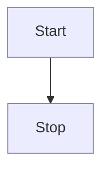

This declares the graph is oriented from left to right (`LR`).

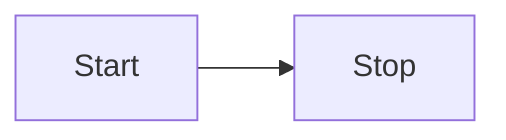

### [Flowchart Orientation](https://mermaid-js.github.io/mermaid/#/flowchart?id=flowchart-orientation)

Possible FlowChart orientations are:

- TB - top to bottom
- TD - top-down/ same as top to bottom
- BT - bottom to top
- RL - right to left
- LR - left to right

### [Flowcharts](https://mermaid-js.github.io/mermaid/#/flowchart?id=flowcharts)

This renders a flowchart that allows for features such as: more arrow types, multi directional arrows, and linking to and from subgraphs.

Apart from the graph type, the syntax is the same. This is currently experimental but when the beta period is over, both the graph and flowchart keywords will render in the new way. This means it is ok to start beta testing flowcharts.

> **Important note** Do not type the word "end" as a Flowchart node. Capitalize all or any one the letters to keep the flowchart from breaking, i.e, "End" or "END". Or you can apply this [workaround](https://github.com/mermaid-js/mermaid/issues/1444#issuecomment-639528897).**

### [Nodes & shapes](https://mermaid-js.github.io/mermaid/#/flowchart?id=nodes-amp-shapes)

#### [A node (default)](https://mermaid-js.github.io/mermaid/#/flowchart?id=a-node-default)

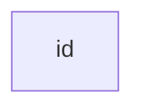

> **Note** The id is what is displayed in the box.

#### [A node with text](https://mermaid-js.github.io/mermaid/#/flowchart?id=a-node-with-text)

It is also possible to set text in the box that differs from the id. If this is done several times, it is the last text found for the node that will be used. Also if you define edges for the node later on, you can omit text definitions. The one previously defined will be used when rendering the box.

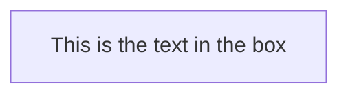

### [Node Shapes](https://mermaid-js.github.io/mermaid/#/flowchart?id=node-shapes)

#### [A node with round edges](https://mermaid-js.github.io/mermaid/#/flowchart?id=a-node-with-round-edges)

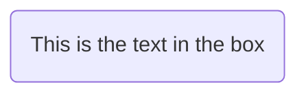

#### [A stadium-shaped node](https://mermaid-js.github.io/mermaid/#/flowchart?id=a-stadium-shaped-node)

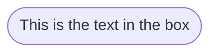

#### [A node in a subroutine shape](https://mermaid-js.github.io/mermaid/#/flowchart?id=a-node-in-a-subroutine-shape)

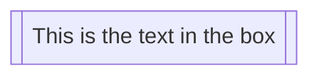

#### [A node in a cylindrical shape](https://mermaid-js.github.io/mermaid/#/flowchart?id=a-node-in-a-cylindrical-shape)

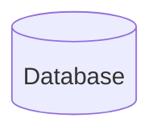

#### [A node in the form of a circle](https://mermaid-js.github.io/mermaid/#/flowchart?id=a-node-in-the-form-of-a-circle)

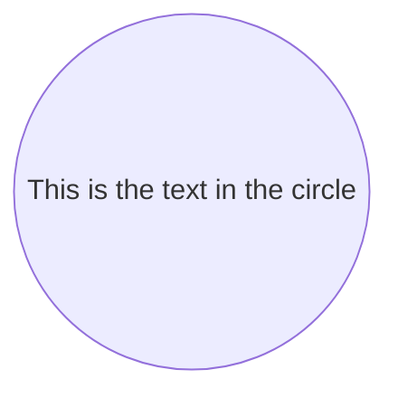

#### [A node in an asymmetric shape](https://mermaid-js.github.io/mermaid/#/flowchart?id=a-node-in-an-asymmetric-shape)

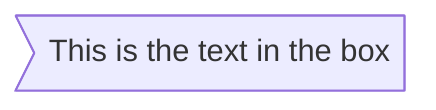

Currently only the shape above is possible and not its mirror. *This might change with future releases.*

#### [A node (rhombus)](https://mermaid-js.github.io/mermaid/#/flowchart?id=a-node-rhombus)

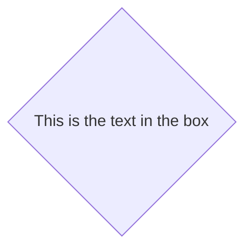

#### [A hexagon node](https://mermaid-js.github.io/mermaid/#/flowchart?id=a-hexagon-node)

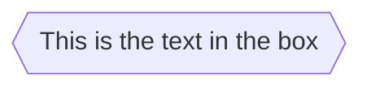

#### [Parallelogram](https://mermaid-js.github.io/mermaid/#/flowchart?id=parallelogram)

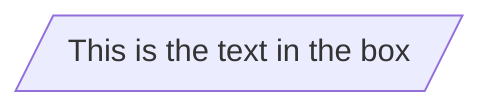

This is the text in the box

#### [Parallelogram alt](https://mermaid-js.github.io/mermaid/#/flowchart?id=parallelogram-alt)

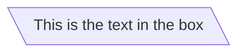

#### [Trapezoid](https://mermaid-js.github.io/mermaid/#/flowchart?id=trapezoid)

```mermaid
graph TD
    A[/Christmas\]
```

#### [Trapezoid alt](https://mermaid-js.github.io/mermaid/#/flowchart?id=trapezoid-alt)

```mermaid
graph TD
    B[\Go shopping/]
```

### [Links between nodes](https://mermaid-js.github.io/mermaid/#/flowchart?id=links-between-nodes)

Nodes can be connected with links/edges. It is possible to have different types of links or attach a text string to a link.

#### [A link with arrow head](https://mermaid-js.github.io/mermaid/#/flowchart?id=a-link-with-arrow-head)

```mermaid
graph LR
    A-->B
```

#### [An open link](https://mermaid-js.github.io/mermaid/#/flowchart?id=an-open-link)

```mermaid
graph LR
    A --- B
```

#### [Text on links](https://mermaid-js.github.io/mermaid/#/flowchart?id=text-on-links)

```mermaid
graph LR
    A-- This is the text! ---B
```

This is the textAB

or

```mermaid
graph LR
    A---|This is the text|B
```

#### [A link with arrow head and text](https://mermaid-js.github.io/mermaid/#/flowchart?id=a-link-with-arrow-head-and-text)

```mermaid
graph LR
    A-->|text|B
```

or

```mermaid
graph LR
    A-- text -->B
```

#### [Dotted link](https://mermaid-js.github.io/mermaid/#/flowchart?id=dotted-link)

```mermaid
graph LR;
   A-.->B;
```

#### [Dotted link with text](https://mermaid-js.github.io/mermaid/#/flowchart?id=dotted-link-with-text)

```mermaid
graph LR
   A-. text .-> B
```

#### [Thick link](https://mermaid-js.github.io/mermaid/#/flowchart?id=thick-link)

```mermaid
graph LR
   A ==> B
```

#### [Thick link with text](https://mermaid-js.github.io/mermaid/#/flowchart?id=thick-link-with-text)

```mermaid
graph LR
   A == text ==> B
```

#### [Chaining of links](https://mermaid-js.github.io/mermaid/#/flowchart?id=chaining-of-links)

It is possible declare many links in the same line as per below:

```mermaid
graph LR
   A -- text --> B -- text2 --> C
```

texttext2ABC

It is also possible to declare multiple nodes links in the same line as per below:

```mermaid
graph LR
   a --> b & c--> d
```

You can then describe dependencies in a very expressive way. Like the one-liner below:

```mermaid
graph TB
    A & B--> C & D
```

If you describe the same diagram using the the basic syntax, it will take four lines. A word of warning, one could go overboard with this making the graph harder to read in markdown form. The Swedish word `lagom` comes to mind. It means, not too much and not too little. This goes for expressive syntaxes as well.

```mermaid
graph TB
    A --> C
    A --> D
    B --> C
    B --> D
```

#### [Beta: New arrow types](https://mermaid-js.github.io/mermaid/#/flowchart?id=beta-new-arrow-types)

When using flowchart instead of graph there are new types of arrows supported as per below:

```mermaid
flowchart LR
    A --o B
    B --x C
```

#### [Beta: Multi directional arrows](https://mermaid-js.github.io/mermaid/#/flowchart?id=beta-multi-directional-arrows)

When using flowchart instead of graph there is the possibility to use multidirectional arrows.

```mermaid
flowchart LR
    A o--o B
    B <--> C
    C x--x D
```

#### [Minimum length of a link](https://mermaid-js.github.io/mermaid/#/flowchart?id=minimum-length-of-a-link)

Each node in the flowchart is ultimately assigned to a rank in the rendered graph, i.e. to a vertical or horizontal level (depending on the flowchart orientation), based on the nodes to which it is linked. By default, links can span any number of ranks, but you can ask for any link to be longer than the others by adding extra dashes in the link definition.

In the following example, two extra dashes are added in the link from node *B* to node *E*, so that it spans two more ranks than regular links:

```mermaid
graph TD
    A[Start] --> B{Is it?};
    B -->|Yes| C[OK];
    C --> D[Rethink];
    D --> B;
    B ---->|No| E[End];
```

> **Note** Links may still be made longer than the requested number of ranks by the rendering engine to accommodate other requests.

When the link label is written in the middle of the link, the extra dashes must be added on the right side of the link. The following example is equivalent to the previous one:

```mermaid
graph TD
    A[Start] --> B{Is it?};
    B -- Yes --> C[OK];
    C --> D[Rethink];
    D --> B;
    B -- No ----> E[End];
```

For dotted or thick links, the characters to add are equals signs or dots, as summed up in the following table:

| Length            | 1      | 2       | 3        |
| ----------------- | ------ | ------- | -------- |
| Normal            | `---`  | `----`  | `-----`  |
| Normal with arrow | `-->`  | `--->`  | `---->`  |
| Thick             | `===`  | `====`  | `=====`  |
| Thick with arrow  | `==>`  | `===>`  | `====>`  |
| Dotted            | `-.-`  | `-..-`  | `-...-`  |
| Dotted with arrow | `-.->` | `-..->` | `-...->` |

### [Special characters that break syntax](https://mermaid-js.github.io/mermaid/#/flowchart?id=special-characters-that-break-syntax)

It is possible to put text within quotes in order to render more troublesome characters. As in the example below:

```mermaid
graph LR
    id1["This is the (text) in the box"]
```

#### [Entity codes to escape characters](https://mermaid-js.github.io/mermaid/#/flowchart?id=entity-codes-to-escape-characters)

It is possible to escape characters using the syntax exemplified here.

```mermaid
    graph LR
        A["A double quote:#quot;"] -->B["A dec char:#9829;"]
```

Numbers given are base 10, so `#` can be encoded as `#35;`. It is also supported to use HTML character names.

### [Subgraphs](https://mermaid-js.github.io/mermaid/#/flowchart?id=subgraphs)

```mermaid
subgraph title
    graph definition
end
```

An example below:

```mermaid
graph TB
    c1-->a2
    subgraph one
    a1-->a2
    end
    subgraph two
    b1-->b2
    end
    subgraph three
    c1-->c2
    end
```

You can also set an explicit id for the subgraph.

```mermaid
graph TB
    c1-->a2
    subgraph ide1 [one]
    a1-->a2
    end
```

### [Beta: flowcharts](https://mermaid-js.github.io/mermaid/#/flowchart?id=beta-flowcharts)

With the graphtype flowcharts it is also possible to set edges to and from subgraphs as in the graph below.

```mermaid
flowchart TB
    c1-->a2
    subgraph one
    a1-->a2
    end
    subgraph two
    b1-->b2
    end
    subgraph three
    c1-->c2
    end
    one --> two
    three --> two
    two --> c2
```

threeonec2c1twob2b1a2a1

### [Interaction](https://mermaid-js.github.io/mermaid/#/flowchart?id=interaction)

It is possible to bind a click event to a node, the click can lead to either a javascript callback or to a link which will be opened in a new browser tab. **Note**: This functionality is disabled when using `securityLevel='strict'` and enabled when using `securityLevel='loose'`.

```
click nodeId callback
click nodeId call callback()
```

- nodeId is the id of the node
- callback is the name of a javascript function defined on the page displaying the graph, the function will be called with the nodeId as parameter.

Examples of tooltip usage below:

```html
<script>
  var callback = function(){
      alert('A callback was triggered');
  }
</script>
```

```mermaid
graph LR;
    A-->B;
    B-->C;
    C-->D;
    click A callback "Tooltip for a callback"
    click B "http://www.github.com" "This is a tooltip for a link"
    click A call callback() "Tooltip for a callback"
    click B href "http://www.github.com" "This is a tooltip for a link"
```


The tooltip text is surrounded in double quotes. The styles of the tooltip are set by the class .mermaidTooltip.

> **Success** The tooltip functionality and the ability to link to urls are available from version 0.5.2.

Due to limitations with how Docsify handles JavaScript callback functions, an alternate working demo for the above code can be viewed at [this jsfiddle](https://jsfiddle.net/s37cjoau/3/).

Links are opened in the same browser tab/window by default. It is possible to change this by adding a link target to the click definition (`_self`, `_blank`, `_parent` and `_top` are supported):

```mermaid
graph LR;
    A-->B;
    B-->C;
    C-->D;
    D-->E;
    click A "http://www.github.com" _blank
    click B "http://www.github.com" "Open this in a new tab" _blank
    click C href "http://www.github.com" _blank
    click D href "http://www.github.com" "Open this in a new tab" _blank
```

Beginners tip, a full example using interactive links in a html context:

```html
<body>
  <div class="mermaid">
    graph LR;
        A-->B;
        B-->C;
        C-->D;
        click A callback "Tooltip"
        click B "http://www.github.com" "This is a link"
        click C call callback() "Tooltip"
        click D href "http://www.github.com" "This is a link"
  </div>

  <script>
    var callback = function(){
        alert('A callback was triggered');
    }
    var config = {
        startOnLoad:true,
        flowchart:{
            useMaxWidth:true,
            htmlLabels:true,
            curve:'cardinal',
        },
        securityLevel:'loose',
    };

    mermaid.initialize(config);
  </script>
</body>
```

#### [Comments](https://mermaid-js.github.io/mermaid/#/flowchart?id=comments)

Comments can be entered within a flow diagram, which will be ignored by the parser. Comments need to be on their own line, and must be prefaced with `%%` (double percent signs). Any text after the start of the comment to the next newline will be treated as a comment, including any flow syntax

```mermaid
graph LR
%% this is a comment A -- text --> B{node}
   A -- text --> B -- text2 --> C
```

### [Styling and classes](https://mermaid-js.github.io/mermaid/#/flowchart?id=styling-and-classes)

#### [Styling links](https://mermaid-js.github.io/mermaid/#/flowchart?id=styling-links)

It is possible to style links. For instance you might want to style a link that is going backwards in the flow. As links have no ids in the same way as nodes, some other way of deciding what style the links should be attached to is required. Instead of ids, the order number of when the link was defined in the graph is used. In the example below the style defined in the linkStyle statement will belong to the fourth link in the graph:

```
linkStyle 3 stroke:#ff3,stroke-width:4px,color:red;
```

#### [Styling a node](https://mermaid-js.github.io/mermaid/#/flowchart?id=styling-a-node)

It is possible to apply specific styles such as a thicker border or a different background color to a node.

```mermaid
graph LR
    id1(Start)-->id2(Stop)
    style id1 fill:#f9f,stroke:#333,stroke-width:4px
    style id2 fill:#bbf,stroke:#f66,stroke-width:2px,color:#fff,stroke-dasharray: 5 5
```

StartStop

##### [Classes](https://mermaid-js.github.io/mermaid/#/flowchart?id=classes)

More convenient then defining the style every time is to define a class of styles and attach this class to the nodes that should have a different look.

a class definition looks like the example below:

```
    classDef className fill:#f9f,stroke:#333,stroke-width:4px;
```

Attachment of a class to a node is done as per below:

```
    class nodeId1 className;
```

It is also possible to attach a class to a list of nodes in one statement:

```
    class nodeId1,nodeId2 className;
```

A shorter form of adding a class is to attach the classname to the node using the `:::`operator as per below:

```mermaid
graph LR
    A:::someclass --> B
    classDef someclass fill:#f96;
```

AB

#### [Css classes](https://mermaid-js.github.io/mermaid/#/flowchart?id=css-classes)

It is also possible to predefine classes in css styles that can be applied from the graph definition as in the example below:

**Example style**

```html
<style>
    .cssClass > rect{
        fill:#FF0000;
        stroke:#FFFF00;
        stroke-width:4px;
    }
</style>
```

**Example definition**

```mermaid
graph LR;
    A-->B[AAA<span>BBB</span>];
    B-->D;
    class A cssClass;
```

AAAA<span>BBB</span>D

#### [Default class](https://mermaid-js.github.io/mermaid/#/flowchart?id=default-class)

If a class is named default it will be assigned to all classes without specific class definitions.

```
    classDef default fill:#f9f,stroke:#333,stroke-width:4px;
```

### [Basic support for fontawesome](https://mermaid-js.github.io/mermaid/#/flowchart?id=basic-support-for-fontawesome)

It is possible to add icons from fontawesome.

The icons are accessed via the syntax fa:#icon class name#.

```mermaid
graph TD
    B["fa:fa-twitter for peace"]
    B-->C[fa:fa-ban forbidden]
    B-->D(fa:fa-spinner);
    B-->E(A fa:fa-camera-retro perhaps?);
```

for peaceforbiddenA perhaps?

### [Graph declarations with spaces between vertices and link and without semicolon](https://mermaid-js.github.io/mermaid/#/flowchart?id=graph-declarations-with-spaces-between-vertices-and-link-and-without-semicolon)

- In graph declarations, the statements also can now end without a semicolon. After release 0.2.16, ending a graph statement with semicolon is just optional. So the below graph declaration is also valid along with the old declarations of the graph.
- A single space is allowed between vertices and the link. However there should not be any space between a vertex and its text and a link and its text. The old syntax of graph declaration will also work and hence this new feature is optional and is introduce to improve readability.

Below is the new declaration of the graph edges which is also valid along with the old declaration of the graph edges.

```mermaid
graph LR
    A[Hard edge] -->|Link text| B(Round edge)
    B --> C{Decision}
    C -->|One| D[Result one]
    C -->|Two| E[Result two]
```

Link textOneTwoHard edgeRound edgeDecisionResult oneResult two

### [Configuration...](https://mermaid-js.github.io/mermaid/#/flowchart?id=configuration)

Is it possible to adjust the width of the rendered flowchart.

This is done by defining **mermaid.flowchartConfig** or by the CLI to use a json file with the configuration. How to use the CLI is described in the mermaidCLI page. mermaid.flowchartConfig can be set to a JSON string with config parameters or the corresponding object.

```javascript
mermaid.flowchartConfig = {
    width: 100%
}
```


## [Sequence diagrams](https://mermaid-js.github.io/mermaid/#/sequenceDiagram?id=sequence-diagrams)

**Edit this Page** [](https://github.com/mermaid-js/mermaid/blob/develop/docs/sequenceDiagram.md)

> A Sequence diagram is an interaction diagram that shows how processes operate with one another and in what order.

Mermaid can render sequence diagrams.

```
sequenceDiagram
    Alice->>John: Hello John, how are you?
    John-->>Alice: Great!
    Alice-)John: See you later!
```

AliceJohnHello John, how are you?Great!See you later!AliceJohn

```note
A note on nodes, the word "end" could potentially break the diagram, due to the way that the mermaid language is scripted.

If unavoidable, one must use parentheses(), quotation marks "", or brackets {},[], to enclose the word "end". i.e : (end), [end], {end}.
```

### [Syntax](https://mermaid-js.github.io/mermaid/#/sequenceDiagram?id=syntax)

#### [Participants](https://mermaid-js.github.io/mermaid/#/sequenceDiagram?id=participants)

The participants can be defined implicitly as in the first example on this page. The participants or actors are rendered in order of appearance in the diagram source text. Sometimes you might want to show the participants in a different order than how they appear in the first message. It is possible to specify the actor's order of appearance by doing the following:

```mermaid
sequenceDiagram
    participant John
    participant Alice
    Alice->>John: Hello John, how are you?
    John-->>Alice: Great!
```

JohnAliceHello John, how are you?Great!JohnAlice

#### [Aliases](https://mermaid-js.github.io/mermaid/#/sequenceDiagram?id=aliases)

The actor can have a convenient identifier and a descriptive label.

```mermaid
sequenceDiagram
    participant A as Alice
    participant J as John
    A->>J: Hello John, how are you?
    J->>A: Great!
```

AliceJohnHello John, how are you?Great!AliceJohn

### [Messages](https://mermaid-js.github.io/mermaid/#/sequenceDiagram?id=messages)

Messages can be of two displayed either solid or with a dotted line.

```
[Actor][Arrow][Actor]:Message text
```

There are six types of arrows currently supported:

| Type | Description                                      |
| ---- | ------------------------------------------------ |
| ->   | Solid line without arrow                         |
| -->  | Dotted line without arrow                        |
| ->>  | Solid line with arrowhead                        |
| -->> | Dotted line with arrowhead                       |
| -x   | Solid line with a cross at the end               |
| --x  | Dotted line with a cross at the end.             |
| -)   | Solid line with an open arrowat the end (async)  |
| --)  | Dotted line with a open arrow at the end (async) |

### [Activations](https://mermaid-js.github.io/mermaid/#/sequenceDiagram?id=activations)

It is possible to activate and deactivate an actor. (de)activation can be dedicated declarations:

```mermaid
sequenceDiagram
    Alice->>John: Hello John, how are you?
    activate John
    John-->>Alice: Great!
    deactivate John
```

AliceJohnHello John, how are you?Great!AliceJohn

There is also a shortcut notation by appending `+`/`-` suffix to the message arrow:

```mermaid
sequenceDiagram
    Alice->>+John: Hello John, how are you?
    John-->>-Alice: Great!
```

AliceJohnHello John, how are you?Great!AliceJohn

Activations can be stacked for same actor:

```mermaid
sequenceDiagram
    Alice->>+John: Hello John, how are you?
    Alice->>+John: John, can you hear me?
    John-->>-Alice: Hi Alice, I can hear you!
    John-->>-Alice: I feel great!
```

AliceJohnHello John, how are you?John, can you hear me?Hi Alice, I can hear you!I feel great!AliceJohn

### [Notes](https://mermaid-js.github.io/mermaid/#/sequenceDiagram?id=notes)

It is possible to add notes to a sequence diagram. This is done by the notation Note [ right of | left of | over ] [Actor]: Text in note content

See the example below:

```mermaid
sequenceDiagram
    participant John
    Note right of John: Text in note
```

JohnText in noteJohn

It is also possible to create notes spanning two participants:

```mermaid
sequenceDiagram
    Alice->John: Hello John, how are you?
    Note over Alice,John: A typical interaction
```

AliceJohnHello John, how are you?A typical interactionAliceJohn

### [Loops](https://mermaid-js.github.io/mermaid/#/sequenceDiagram?id=loops)

It is possible to express loops in a sequence diagram. This is done by the notation

```
loop Loop text
... statements ...
end
```

See the example below:

```mermaid
sequenceDiagram
    Alice->John: Hello John, how are you?
    loop Every minute
        John-->Alice: Great!
    end
```

AliceJohnHello John, how are you?Great!loop[Every minute]AliceJohn

### [Alt](https://mermaid-js.github.io/mermaid/#/sequenceDiagram?id=alt)

It is possible to express alternative paths in a sequence diagram. This is done by the notation

```
alt Describing text
... statements ...
else
... statements ...
end
```

or if there is sequence that is optional (if without else).

```
opt Describing text
... statements ...
end
```

See the example below:

```mermaid
sequenceDiagram
    Alice->>Bob: Hello Bob, how are you?
    alt is sick
        Bob->>Alice: Not so good :(
    else is well
        Bob->>Alice: Feeling fresh like a daisy
    end
    opt Extra response
        Bob->>Alice: Thanks for asking
    end
```

AliceBobHello Bob, how are you?Not so good :(Feeling fresh like a daisyalt[is sick][is well]Thanks for askingopt[Extra response]AliceBob

### [Parallel](https://mermaid-js.github.io/mermaid/#/sequenceDiagram?id=parallel)

It is possible to show actions that are happening in parallel.

This is done by the notation

```
par [Action 1]
... statements ...
and [Action 2]
... statements ...
and [Action N]
... statements ...
end
```

See the example below:

`todo`

AliceBobJohnHello guys!Hello guys!par[Alice to Bob][Alice to John]Hi Alice!Hi Alice!AliceBobJohn

It is also possible to nest parallel blocks.

`todo`

AliceBobJohnCharlieDianaGo help JohnI want this done todayCan we do this today?Can you help us today?par[John to Charlie][John to Diana]par[Alice to Bob][Alice to John]AliceBobJohnCharlieDiana

### [Background Highlighting](https://mermaid-js.github.io/mermaid/#/sequenceDiagram?id=background-highlighting)

It is possible to highlight flows by providing colored background rects. This is done by the notation

The colors are defined using rgb and rgba syntax.

```
rect rgb(0, 255, 0)
... content ...
end
rect rgba(0, 0, 255, .1)
... content ...
end
```

See the examples below:

AliceJohnAlice calls John.Hello John, how are you?John, can you hear me?Hi Alice, I can hear you!I feel great!Did you want to go to the game tonight?Yeah! See you there.AliceJohn

### [Comments](https://mermaid-js.github.io/mermaid/#/sequenceDiagram?id=comments)

Comments can be entered within a sequence diagram, which will be ignored by the parser. Comments need to be on their own line, and must be prefaced with `%%` (double percent signs). Any text after the start of the comment to the next newline will be treated as a comment, including any diagram syntax

```mermaid
sequenceDiagram
    Alice->>John: Hello John, how are you?
    %% this is a comment
    John-->>Alice: Great!
```

### [Entity codes to escape characters](https://mermaid-js.github.io/mermaid/#/sequenceDiagram?id=entity-codes-to-escape-characters)

It is possible to escape characters using the syntax exemplified here.

```mermaid
sequenceDiagram
    A->>B: I #9829; you!
    B->>A: I #9829; you #infin; times more!
```

ABI ♥ you!I ♥ you ∞ times more!AB

Numbers given are base 10, so `#` can be encoded as `#35;`. It is also supported to use HTML character names.

### [sequenceNumbers](https://mermaid-js.github.io/mermaid/#/sequenceDiagram?id=sequencenumbers)

It is possible to get a sequence number attached to each arrow in a sequence diagram. This can be configured when adding mermaid to the website as shown below:

```
    <script>
      mermaid.initialize({
        sequence: { showSequenceNumbers: true },
      });
    </script>
```

It can also be be turned on via the diagram code as in the diagram:

```mermaid
sequenceDiagram
    autonumber
    Alice->>John: Hello John, how are you?
    loop Healthcheck
        John->>John: Fight against hypochondria
    end
    Note right of John: Rational thoughts!
    John-->>Alice: Great!
    John->>Bob: How about you?
    Bob-->>John: Jolly good!
```

AliceJohnBobHello John, how are you?1Fight against hypochondria2loop[Healthcheck]Rational thoughts!Great!3How about you?4Jolly good!5AliceJohnBob

### [Styling](https://mermaid-js.github.io/mermaid/#/sequenceDiagram?id=styling)

Styling of a sequence diagram is done by defining a number of css classes. During rendering these classes are extracted from the file located at src/themes/sequence.scss

#### [Classes used](https://mermaid-js.github.io/mermaid/#/sequenceDiagram?id=classes-used)

| Class        | Description                                                 |
| ------------ | ----------------------------------------------------------- |
| actor        | Style for the actor box at the top of the diagram.          |
| text.actor   | Styles for text in the actor box at the top of the diagram. |
| actor-line   | The vertical line for an actor.                             |
| messageLine0 | Styles for the solid message line.                          |
| messageLine1 | Styles for the dotted message line.                         |
| messageText  | Defines styles for the text on the message arrows.          |
| labelBox     | Defines styles label to left in a loop.                     |
| labelText    | Styles for the text in label for loops.                     |
| loopText     | Styles for the text in the loop box.                        |
| loopLine     | Defines styles for the lines in the loop box.               |
| note         | Styles for the note box.                                    |
| noteText     | Styles for the text on in the note boxes.                   |

#### [Sample stylesheet](https://mermaid-js.github.io/mermaid/#/sequenceDiagram?id=sample-stylesheet)

```css
body {
    background: white;
}

.actor {
    stroke: #ccccff;
    fill: #ececff;
}
text.actor {
    fill: black;
    stroke: none;
    font-family: Helvetica;
}

.actor-line {
    stroke: grey;
}

.messageLine0 {
    stroke-width: 1.5;
    stroke-dasharray: '2 2';
    marker-end: 'url(#arrowhead)';
    stroke: black;
}

.messageLine1 {
    stroke-width: 1.5;
    stroke-dasharray: '2 2';
    stroke: black;
}

#arrowhead {
    fill: black;
}

.messageText {
    fill: black;
    stroke: none;
    font-family: 'trebuchet ms', verdana, arial;
    font-size: 14px;
}

.labelBox {
    stroke: #ccccff;
    fill: #ececff;
}

.labelText {
    fill: black;
    stroke: none;
    font-family: 'trebuchet ms', verdana, arial;
}

.loopText {
    fill: black;
    stroke: none;
    font-family: 'trebuchet ms', verdana, arial;
}

.loopLine {
    stroke-width: 2;
    stroke-dasharray: '2 2';
    marker-end: 'url(#arrowhead)';
    stroke: #ccccff;
}

.note {
    stroke: #decc93;
    fill: #fff5ad;
}

.noteText {
    fill: black;
    stroke: none;
    font-family: 'trebuchet ms', verdana, arial;
    font-size: 14px;
}
```

### [Configuration](https://mermaid-js.github.io/mermaid/#/sequenceDiagram?id=configuration)

Is it possible to adjust the margins for rendering the sequence diagram.

This is done by defining `mermaid.sequenceConfig` or by the CLI to use a json file with the configuration. How to use the CLI is described in the [mermaidCLI](https://mermaid-js.github.io/mermaid/#/mermaidCLI.html) page. `mermaid.sequenceConfig` can be set to a JSON string with config parameters or the corresponding object.

```javascript
mermaid.sequenceConfig = {
    diagramMarginX: 50,
    diagramMarginY: 10,
    boxTextMargin: 5,
    noteMargin: 10,
    messageMargin: 35,
    mirrorActors: true
};
```

#### [Possible configuration parameters:](https://mermaid-js.github.io/mermaid/#/sequenceDiagram?id=possible-configuration-parameters)

| Parameter         | Description                                                  | Default value                  |
| ----------------- | ------------------------------------------------------------ | ------------------------------ |
| mirrorActors      | Turns on/off the rendering of actors below the diagram as well as above it | false                          |
| bottomMarginAdj   | Adjusts how far down the graph ended. Wide borders styles with css could generate unwanted clipping which is why this config param exists. | 1                              |
| actorFontSize     | Sets the font size for the actor's description               | 14                             |
| actorFontFamily   | Sets the font family for the actor's description             | "Open-Sans", "sans-serif"      |
| actorFontWeight   | Sets the font weight for the actor's description             | "Open-Sans", "sans-serif"      |
| noteFontSize      | Sets the font size for actor-attached notes                  | 14                             |
| noteFontFamily    | Sets the font family for actor-attached notes                | "trebuchet ms", verdana, arial |
| noteFontWeight    | Sets the font weight for actor-attached notes                | "trebuchet ms", verdana, arial |
| noteAlign         | Sets the text alignment for text in actor-attached notes     | center                         |
| messageFontSize   | Sets the font size for actor<->actor messages                | 16                             |
| messageFontFamily | Sets the font family for actor<->actor messages              | "trebuchet ms", verdana, arial |
| messageFontWeight | Sets the font weight for actor<->actor messages              | "trebuchet ms", verdana, arial |